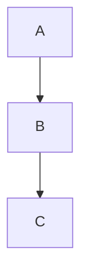

# Obsidian 知识库使用指南

## 一、快速开始

### 1.1 安装 Obsidian

1. 下载 [Obsidian](https://obsidian.md/)
2. 选择**本地仓库**模式
3. 选择 `/root/obsidian-vault` 作为仓库路径

### 1.2 启用核心插件

Obsidian -> 设置 -> 核心插件 -> 启用以下功能：

- ✅ 文件列表
- ✅ 搜索
- ✅ 快速切换
- ✅ 反向链接
- ✅ 出站链接
- ✅ 标签面板
- ✅ 页面预览
- ✅ 每日笔记
- ✅ 模板
- ✅ 大纲
- ✅ 字数统计

### 1.3 推荐社区插件

安装以下插件（设置 -> 社区插件 -> 关闭安全模式）：

| 插件名称 | 功能 | 推荐指数 |
|---------|------|----------|
| **Templater** | 高级模板 | ⭐⭐⭐⭐⭐ |
| **_dataview** | 数据查询 | ⭐⭐⭐⭐⭐ |
| **Calendar** | 日历视图 | ⭐⭐⭐⭐⭐ |
| **Iconize** | 文件夹图标 | ⭐⭐⭐⭐ |
| **Tag Wrangler** | 标签管理 | ⭐⭐⭐⭐ |
| **Ozan's Image in Vault** | 图片粘贴 | ⭐⭐⭐⭐ |
| **Advanced Tables** | 表格增强 | ⭐⭐⭐⭐ |
| **Reminder** | 任务提醒 | ⭐⭐⭐⭐ |

## 二、目录结构

```
obsidian-vault/
├── 00-Templates/          # 模板文件夹
│   ├── Daily.md          # 每日笔记模板
│   ├── Note.md          # 普通笔记模板
│   └── Book.md          # 读书笔记模板
│
├── 01-编程学习/           # 编程技术笔记
├── 02-财经投资/           # 投资理财笔记
├── 03-学习方法/           # 学习方法笔记
├── 04-生活健康/           # 健康生活笔记
├── 05-职业发展/           # 职业发展笔记
│
├── 90-Attachments/       # 附件文件夹
├── 91-Inbox/             # 收件箱（每日笔记存放位置）
├── zz-Archive/           # 归档文件夹
│
├── 知识地图.md            # 知识体系总览
├── About.md              # 关于我
└── .obsidian/            # Obsidian 配置（勿修改）
```

## 三、双向链接

### 3.1 创建链接

```markdown
[[笔记名称]]           # 链接到其他笔记
[[笔记名称|显示文本]]  # 带显示文本的链接
![[笔记名称]]          # 嵌入笔记内容
```

### 3.2 反向链接

在笔记底部可以看到**反向链接**面板，显示所有引用该笔记的其他笔记。

### 3.3 知识图谱

按 `Ctrl/Cmd + G` 打开本地图谱，查看笔记间的关联。

## 四、标签系统

### 4.1 使用标签

```markdown
#编程        # 单个标签
#投资/股票   # 嵌套标签
#2024/01    # 按时间归档
```

### 4.2 标签面板

在侧边栏打开**标签面板**，浏览所有标签。

## 五、模板使用

### 5.1 快捷键创建

1. 安装 **Templater** 插件
2. 设置模板文件夹为 `00-Templates/`
3. 创建笔记时使用 `Ctrl/Cmd + P` -> `Templater:..`

### 5.2 模板变量

- `{{title}}` - 文件名
- `{{date}}` - 当前日期
- `{{time}}` - 当前时间
- `{{cursor}}` - 光标位置

## 六、搜索与查询

### 6.1 快速搜索

按 `Ctrl/Cmd + O` 打开快速切换器，输入笔记名搜索。

### 6.2 全局搜索

按 `Ctrl/Cmd + Shift + F` 进行全局搜索，支持正则表达式。

### 6.3 Dataview 查询

```dataview
TABLE file.ctime AS 创建时间, tags
FROM "02-财经投资"
SORT file.ctime DESC
LIMIT 10
```

## 七、同步方案

### 7.1 方案一：iCloud / OneDrive（推荐个人使用）

1. 将 vault 放在云同步文件夹
2. 自动同步到多设备

### 7.2 方案二：Git（推荐开发者）

```bash
# 在 vault 目录初始化 Git
cd /root/obsidian-vault
git init
git add .
git commit -m "Initial commit"
git remote add origin your-git-repo
git push -u origin main
```

### 7.3 方案三：Obsidian Sync（官方付费）

- 官方同步服务，$8/月
- 支持端到端加密

### 7.4 方案四：Syncthing（免费自托管）

```bash
# 安装 Syncthing
sudo apt install syncthing

# 配置同步
syncthing
```

## 八、发布到网络

### 8.1 Obsidian Publish（官方）

1. Obsidian Sync 设置 -> 启用 Publish
2. 选择要发布的笔记
3. 获取公开链接

### 8.2 静态网站生成器方案

#### 方案 A: Quotid

```bash
# 安装
npm install -g quotably

# 发布
quotid publish
```

#### 方案 B: Quartz

```bash
# 克隆 Quartz
git clone https://github.com/jackyzha0/quartz.git
cd quartz

# 配置
cp config.example.toml config.toml

# 添加内容到 content/ 目录
cp -r /root/obsidian-vault/* content/

# 构建
npx quartz build

# 托管 public/ 目录
```

#### 方案 C: Hugo + Obsidian（保留现有）

保持 Hugo 用于公网展示，Obsidian 用于本地管理。

## 九、快捷键速查

| 快捷键 | 功能 |
|--------|------|
| `Ctrl/Cmd + O` | 快速切换 |
| `Ctrl/Cmd + N` | 新建笔记 |
| `Ctrl/Cmd + P` | 命令面板 |
| `Ctrl/Cmd + F` | 搜索（当前文件） |
| `Ctrl/Cmd + Shift + F` | 全局搜索 |
| `Ctrl/Cmd + E` | 切换编辑/预览 |
| `Ctrl/Cmd + G` | 打开图谱 |
| `Ctrl/Cmd + [` | 减少缩进 |
| `Ctrl/Cmd + ]` | 增加缩进 |
| `[[` | 插入链接 |

## 十、进阶技巧

### 10.1 Mermaid 图表

````markdown

````

### 10.2 Callout 提示块

````markdown
> [!note]
> 这是一个提示框
>
> [!warning]
> 这是一个警告
>
> [!tip]
> 这是一个技巧
````

### 10.3 任务列表

```markdown
- [ ] 未完成任务
- [x] 已完成任务
- [>] 推迟任务
```

## 十一、常见问题

### Q1: 如何导入 Hugo 博客内容？

运行迁移脚本：

```bash
cd /root/obsidian-vault
bash migrate.sh
```

### Q2: 图片如何处理？

- 将图片放在 `90-Attachments/` 文件夹
- 使用 `![[图片名.png]]` 嵌入

### Q3: 如何保持 Hugo 和 Obsidian 同步？

1. 在 Obsidian 中编辑笔记
2. 使用脚本将笔记同步回 Hugo 的 content 目录
3. 重新构建 Hugo 网站

---

*有问题？查看 Obsidian 官方文档: https://help.obsidian.md/*
