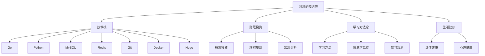

# 滔滔的知识库

> 记录学习历程，沉淀知识体系

## 📚 知识体系总览

## 🛠️ 技术栈

| 分类 | 技术 | 熟练度 |
|------|------|--------|
| 后端开发 | Go, Python | ⭐⭐⭐⭐ |
| 数据库 | MySQL, MongoDB, Redis | ⭐⭐⭐⭐ |
| 工具链 | Git, Docker, Hugo | ⭐⭐⭐⭐⭐ |
| 协议 | Protocol Buffers, gRPC | ⭐⭐⭐ |

## 📈 财经投资

- [[如何选择股票]]
- [[股票什么时候没有风险]]
- [[理财计划]]
- [[2024投资总结与预测]]

## 📖 学习方法

- [[提升学习效率]]
- [[信息学竞赛学习路线]]
- [[小升初规划]]

## 🏃 生活健康

- [[锻炼与压力管理]]

## 🎯 2026 学习目标

- [ ] 深入理解分布式系统
- [ ] 建立个人投资体系
- [ ] 持续输出技术博客

---

*最后更新: {{date}}*
